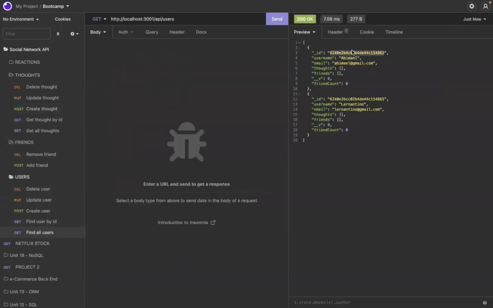

# Social Network API

## Description
    
This is an API for a social network where users can post thoughts, add/remove friends, and post reactions on other's posts. It was built by using Express.js for routing, a MongoDB database, and the Mongoose ODM.
    
## Table of Contents

- [Technologies](#technologies)
- [Installation](#installation)
- [Usage](#usage)
- [Contribute](#contribute)
- [Questions](#questions)

## Technologies

MongoDB | Mongoose | Node.js | Express.js | JavaScript  
    
## Installation

In order to install dependencies, run the following command: 

    npm i
    
## Usage
    
Once you install the dependencies, run "npm start" to connect to the API server, then you can test each one of the routes on Insomnia. Navigate to the routes/api folder to see the routes. Refer to the files in the Models folder to see how to post the information.

The following video demonstrates the process of making API requests.

## Contribute
    
If you would like to contribute to this project, feel free to make a pull request.
    
## Questions

If you have any questions, open an issue or contact me directly at abimael.monarrez58@gmail.com. You can find more of my work at [Abimael1996](https://github.com/Abimael1996).

